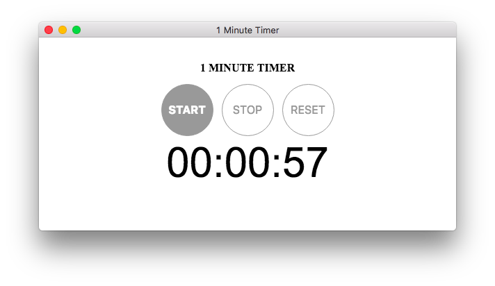

# Electron Application Sample

[](https://travis-ci.org/wakayamarb/1min-timer)

This is a simple repository of desktop application sample made with HTML, CSS and JavaScript based on [Electron](http://electron.atom.io/). Compiled packages are available on Mac, Linux and Windows.

**Features**
- BDD style unit testing
- Scenario based e2e testing
- Testing on Travis CI
- Deployment after success
    - Web preview on Github pages
    - Releasing binaries on Github

Application can be previewed on your Chrome, Firefox or other browsers with ES2015 implementation.

https://wakayamarb.github.io/1min-timer/



## Install

```
$ git clone --depth=1 https://github.com/wakayamarb/1min-timer.git
$ npm install
```

## Test

```
$ npm test
```

## Preview on Electron

```
$ npm start
```

## Build darwin and linux package

```
$ npm run build
```

## Build win32 package on Mac

```
$ brew install wine
$ npm run build-win32
```

## Build win32 package on Windows

It have been never tried but perhaps command below works.
```
$ npm run build-win32
```
